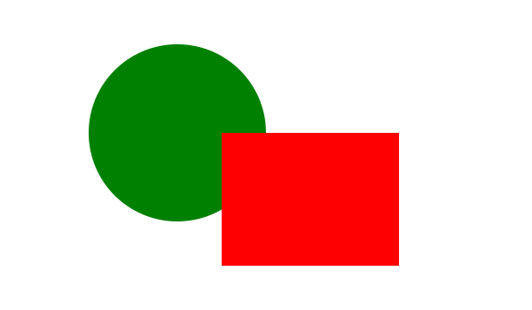

# Interactive Web
## Canvas, SVG, CSS3

http://goo.gl/Qqs2sM

---
## 今回の内容

- 動く UI 要素
- グラフ、チャートなど

---
## アコーディオン

<iframe src="accordion.html" class="demo"></iframe>

---
## ギャラリー (Lightbox)

<iframe src="swipebox.html" class="demo"></iframe>

---
## スピン

<iframe src="spin.html" class="demo"></iframe>

---
## チャート

<iframe src="chart.html" class="demo"></iframe>

---

<section data-background="assets/img/visual.jpg">

<h2>スコープ外</h2>
<ul>
	<li>3D</li>
	<li>CG</li>
	<li>Visualization</li>
</ul>

</section>

---
## 技術

- Canvas
- SVG
- CSS3

---
## 割と同じようなもの作れる

---
## Progreess Circle

- [Canvas 版](http://anthonyterrien.com/knob/)
- [SVG 版](http://blog.sodhanalibrary.com/2014/04/circular-progress-with-svg-and.html)
- [CSS3 版](http://blakek.us/labs/jquery/css3-pie-graph-timer/)

---
## Clock
- [Canvas 版](http://www.dhtmlgoodies.com/tutorials/canvas-clock/)
- [SVG 版](http://www.svgjs.com/clock/)
- [CSS3 版](http://www.paulrhayes.com/experiments/clock/#clock)

---
## 違いを見極めたい

---
# Canvas

---
## Canvas

- HTML5 で定義された HTML 要素
	- &lt;canvas&gt;
- Canvas 2D Context
	- 3D は WebGL
- 矩形にビットマップ (ラスタ画像) を描く低レベル API

---
## Canvas: 矩形

<iframe src="canvas1.html" class="demo"></iframe>

---
## Canvas: パス

<iframe src="canvas2.html" class="demo"></iframe>

---
## Canvas: グラデーション

<iframe src="canvas3.html" class="demo"></iframe>

---
## Canvas: 画像

<iframe src="canvas4.html" class="demo"></iframe>

---
## Canvas: ピクセル操作

<iframe src="canvas5.html" class="demo"></iframe>

---
## Canvas: 変換

<iframe src="canvas6.html" class="demo"></iframe>

---
# SVG

---
## SVG
- XML で画像を描く画像ファイル形式
	- 拡張子 .svg
	- ベクター画像。
- HTML5 では HTML 文書に組み込み可能に (インライン SVG)
	- &lt;svg&gt;

---
## SVG: 画像ファイル

---
## SVG: インライン SVG

<svg width="600" height="350">
	<circle cx="200" cy="150" r="100" fill="green" />
	<rect x="250" y="150" width="200" height="150" fill="red" />
</svg>

---
## SVG: 色々な図形

<svg width="600" height="350">
	<ellipse cx="150" cy="100" rx="150" ry="100" fill="green" />
	<line x1="5" y1="10" x2="500" y2="300" stroke="blue" stroke-width="5" />
	<rect x="250" y="150" width="200" height="150" rx="30" ry="30" fill="red" />
</svg>

---
## SVG: 画像

<svg width="600" height="400">
	<ellipse cx="300" cy="200" rx="250" ry="200" fill="green" />
	<image x="100" y="15" width="400" height="350" xlink:href="assets/img/pic.jpg" />
	<line x1="300" y1="0" x2="300" y2="400" stroke="blue" stroke-width="5" />
</svg>

---
## SVG: グラデーション

<svg width="300" height="150">
	<radialGradient id="grad" cx="0.3" cy="0.3" r="0.5">
		<stop offset="0.0" stop-color="#ffffff" />
		<stop offset="0.5" stop-color="#bc8c00" />
		<stop offset="1.0" stop-color="#96420a" />
	</radialGradient>
	<circle cx="150" cy="75" r="60"
		stroke="black" stroke-width="2" fill="url(#grad)" />
</svg>

---
## SVG: パス

<svg width="300" height="150">
	<!--
	 M は始点設定。Canvas の moveTo()
	 L は直線。Canvas の lineTo()
	 Z はパスを閉じる。Canvas の closePath()
	-->
	<path d="M 150,30 L 200,120 L 100,120 Z"
		stroke="red" stroke-width="3" fill="green" />
</svg>

---
## SVG: CSS, イベント

<iframe src="svgevt.html" class="demo"></iframe>

---
## SVG: 変換

<iframe src="svgclock.html" class="demo"></iframe>

---
## Canvas vs SVG

---
## SVG が向いている場合

---
## 拡大される画像

 

### [微細な図](http://ie.microsoft.com/testdrive/Graphics/RealWorldDataAndDiagrams/RespiratorySystem.xhtml)など

---
## インタラクティブな図や表
- 既存データを拡張しやすい
	- Inkspace などのツールで作成して、CSS や JavaScript で拡張。
- DOM 要素ごとにイベントを拾える
	- Canvas では XY 座標からどの部分にヒットしたか自分で判定が必要。
- アクセシビリティ

---
## Canvas が向いている場合

---
## ピクセル操作

- 画像のフィルタ処理。

---
## 描画結果の保存

- toDataURL() や getBlob() で描画結果をアウトプットできる。

---
## 大量オブジェクトの描き込み
- アメダスのような図は SVG では DOM 要素を大量に作る事になりパフォーマンスが悪い。

---
## ゲーム
- 宣言的な SVG より Canvas の低レベル描画 API のほうがゲームプログラマには親しみがある。
- 世の中のゲームエンジンは Canvas で実装しているらしい。

---
# CSS3

---
## もともとの CSS
- フォント指定やテキストの装飾
- 領域 (矩形) の位置、大きさ、枠線、背景

---
## CSS3 で凶悪化
- 角丸 (border-radius)
- グラデーション (gradient)
- 変形 (transform)
- 時間的変化 (transition）
- アニメーション

### …割と何でも描けて動かせるように

---
## [CSS3 ドラえもん](http://purecss3.net/doraemon/doraemon_css3.html)

---
### ハンズオン

## CSS3 クロック

## <http://jsfiddle.net/sb7P6/>

<iframe src="css3clock.html" class="demo"></iframe>

---
### ハンズオン

## トグルスイッチ

## <http://jsfiddle.net/6ue23/>

<iframe src="switch.html" class="demo"></iframe>

---
## まとめ

---
- 図やグラフは SVG が良さそう。
- インタラクティブなのは SVG。
- フィルタ処理や描画結果の保存は Canvas。
- お絵描きソフトやゲームっぽいのは Canvas。
- DOM 要素を動かすのは CSS3。

---
## IE8 以下、Android 2.X は
## お帰りください。
## 以上。

